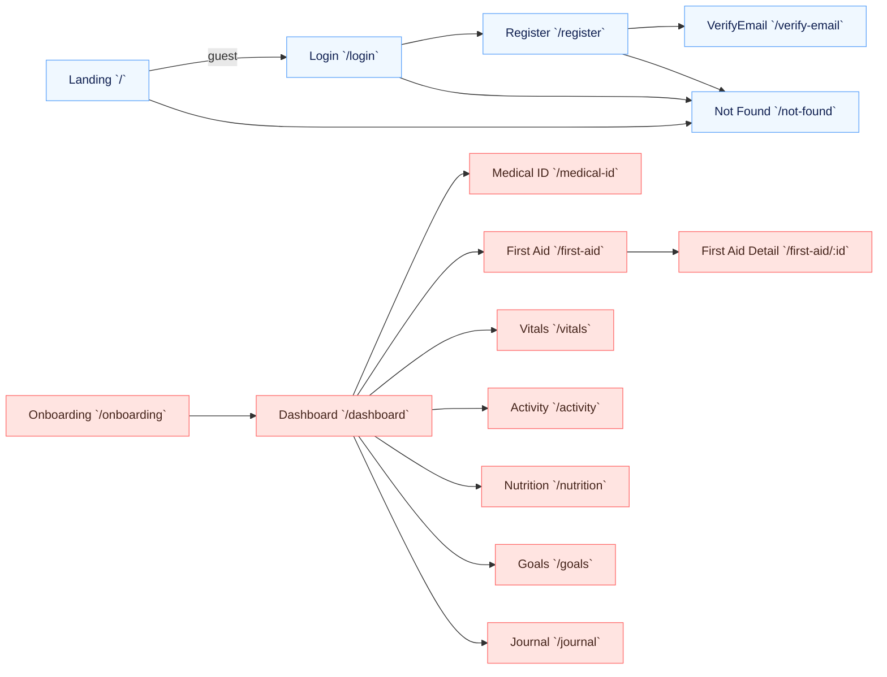
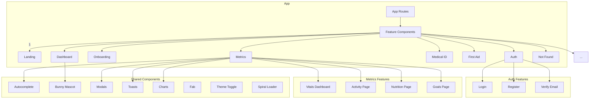
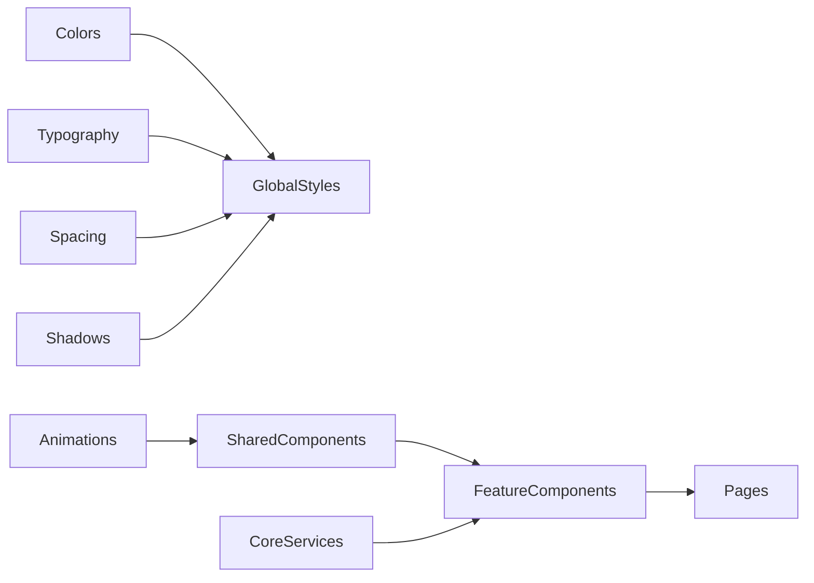
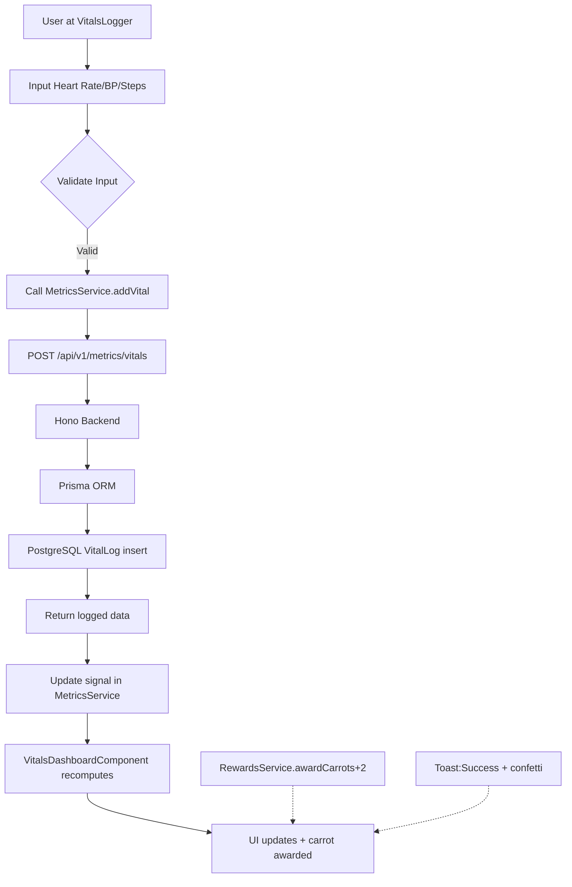

# 🐰 VibeHealth — Complete Design & Architecture Blueprint

> **Comprehensive design specification** for all current and future pages/components with **Google Stitch requirements**, library docs, design system details, and roadmap integration.
> 
> **Status**: Phase 0–1 ✅ (Foundation + Core Health Tracking); Phase 2–5 🚧 Planning  
> **Last Updated**: March 2026

---

## 📋 Table of Contents

1. [Current Route Map (Pages)](#1-current-route-map-pages)
2. [Feature Components Inventory](#2-feature-components-inventory)
3. [Shared UI Component Library](#3-shared-ui-component-library)
4. [Design System & Visual Language](#4-design-system--visual-language)
5. [Google Stitch Integration Guide](#5-google-stitch-integration-guide)
6. [Library Documentation & References](#6-library-documentation--references)
7. [Backend API Surface](#7-backend-api-surface)
8. [Current Design Assets](#8-current-design-assets)
9. [i18n & Localization](#9-i18n--localization)
10. [Roadmap: Detailed Phase Breakdown](#10-roadmap-detailed-phase-breakdown)
11. [Future Pages & Components (Phases 2–5)](#11-future-pages--components-phases-25)
12. [Architecture Diagrams](#12-architecture-diagrams)
13. [Design Checklist & Next Steps](#13-design-checklist--next-steps)

---

## 1) Current Route Map (Pages)

- `/` → `LandingComponent`  (`frontend/src/app/features/landing/landing.component.ts`)
- `/login` → `LoginComponent` (`frontend/src/app/features/auth/login/login.component.ts`)
- `/register` → `RegisterComponent` (`frontend/src/app/features/auth/register/register.component.ts`)
- `/verify-email` → `VerifyEmailComponent` (`frontend/src/app/features/auth/verify-email/verify-email.component.ts`)
- `/onboarding` → `OnboardingComponent` (`frontend/src/app/features/onboarding/onboarding.component.ts`)
- `/dashboard` → `DashboardComponent` (`frontend/src/app/features/dashboard/dashboard.component.ts`)
- `/medical-id` → `MedicalIdComponent` (`frontend/src/app/features/medical-id/medical-id.component.ts`)
- `/first-aid` → `FirstAidComponent` (`frontend/src/app/features/first-aid/first-aid.component.ts`)
- `/first-aid/:id` → `FirstAidDetailComponent` (`frontend/src/app/features/first-aid/first-aid-detail.component.ts`)
- `/vitals` → `VitalsDashboardComponent` (`frontend/src/app/features/metrics/vitals-dashboard.component.ts`)
- `/activity` → `ActivityPageComponent` (`frontend/src/app/features/metrics/activity-page.component.ts`)
- `/nutrition` → `NutritionPageComponent` (`frontend/src/app/features/metrics/nutrition-page.component.ts`)
- `/goals` → `GoalsPageComponent` (`frontend/src/app/features/metrics/goals-page.component.ts`)
- `/journal` → placeholder to `DashboardComponent` (route currently wired to dashboard)
- `/not-found` → `NotFoundComponent` (`frontend/src/app/features/not-found/not-found.component.ts`)
- `**` → redirect `/not-found`

## 2) Feature components

### Metrics feature
- `VitalsDashboardComponent` (`vitals-dashboard.component.ts`)
- `VitalsLoggerComponent` (`vitals-logger.component.ts`)
- `ActivityPageComponent` (`activity-page.component.ts`)
- `ActivityLoggerComponent` (`activity-logger.component.ts`)
- `NutritionPageComponent` (`nutrition-page.component.ts`)
- `NutritionLoggerComponent` (`nutrition-logger.component.ts`)
- `GoalsPageComponent` (`goals-page.component.ts`)
- `GoalWizardComponent` (`goal-wizard.component.ts`)
- `HydrationTrackerComponent` (`hydration-tracker.component.ts`)

### Core/auxiliary features
- `DashboardComponent` (`dashboard.component.ts`)
- `MedicalIdComponent` (`medical-id.component.ts`)
- `FirstAidComponent` (`first-aid.component.ts`)
- `FirstAidDetailComponent` (`first-aid-detail.component.ts`)
- `OnboardingComponent` (`onboarding.component.ts`)
- `LandingComponent` (`landing.component.ts`)
- `LoginComponent` (`login.component.ts`)
- `RegisterComponent` (`register.component.ts`)
- `VerifyEmailComponent` (`verify-email.component.ts`)
- `NotFoundComponent` (`not-found.component.ts`)

## 3) Shared component library

- `trend-chart.component.ts`
- `bunny-mascot.component.ts`
- `animated-icon.component.ts`
- `theme-toggle.component.ts`
- `autocomplete.component.ts`
- `bottom-nav.component.ts`
- `barcode-scanner.component.ts`
- `stats-grid.component.ts`
- `fab.component.ts`
- `modal.component.ts`
- `spiral-loader.component.ts`
- `carrot-counter.component.ts`
- `carrot-feed.component.ts`
- `goey-toast.component.ts`
- `spinner.component.ts`
- `scroll-top-progress.component.ts`
- `social-buttons.component.ts`
- `ng-icon.component.ts`

## 4) Core services & state

- `auth.service.ts`
- `auth.guard.ts`
- `auth.interceptor.ts`
- `profile.service.ts`
- `metrics.service.ts`
- `goals.service.ts`
- `medical-id.service.ts`
- `reference-data.service.ts`
- `rewards.service.ts`
- `toast.service.ts`

## 5) Backend API surface for UI integration

Routes under `backend/src/routes`:
- `auth.routes.ts`
- `profile.routes.ts`
- `medical-id.routes.ts`
- `metrics.routes.ts`
- `reference-data.routes.ts`

Support modules:
- `backend/src/middleware/auth.middleware.ts`
- `backend/src/lib/prisma.ts`
- `backend/src/lib/auth.ts`
- `backend/src/lib/email.ts`

## 6) Design references and docs

### Existing design docs
- `designs/dashboard_v2_desktop/`
- `designs/guides_articles_desktop/`
- `designs/guides_articles_mobile/`
- `designs/login_desktop/`
- `designs/login_mobile/`
- `designs/medical_id_desktop/`
- `designs/medical_id_mobile/`
- `designs/medicine_tracker_desktop/`
- `designs/medicine_tracker_mobile/`
- `designs/velvet_rabbit/DESIGN.md`
- `roadmap.md`, `roadmaps/*`
- `.github/.vibehealth/frontend.md`
- `.github/.vibehealth/backend.md`
- `.github/.vibehealth/design.md`

### i18n files
- `frontend/src/assets/i18n/en.json`
- `frontend/src/assets/i18n/fr.json`

### Global styles and tokens
- `frontend/src/styles.css`
- `frontend/tailwind.config.js`

## 7) Libraries and tech stack (current)

- Angular 21 (standalone components, signals, native control flow)
- Tailwind CSS 3.4
- @lucide/angular, ng-animated-icons
- ngx-translate 17 (localization FR/EN)
- Bun + Hono + Prisma + PostgreSQL backend
- BetterAuth, API versioning `/api/v1`
- Anime.js v4 (animations)
- PWA (service worker, `ngsw-config.json`)

## 8) Style & design guidelines (from `.github/.vibehealth/design.md` + design system)

### Soft Pop aesthetic
- Organic shapes and rounded corners
- Warm gradients (coral → peach)
- Playful motion micro-interactions
- Textured depth rather than sharp flat UI
- Generous whitespace
- Accessible (WCAG AA), no heavy filter blur for performance

### Angular conventions
- `signal()`, `computed()`, no direct `mutate()`
- `@if`, `@for`, `@switch` (no `*ngIf`, `*ngFor`)
- `OnPush` change detection
- `inject()` for DI, not constructors
- `input()/output()` functions

### i18n conventions
- all keys existing in both `en.json` and `fr.json`
- flat key namespace with dots
- use `{{ 'key' | translate }}` in templates

## 9) Future pages / components to predesign

- `JournalComponent` route `/journal` (dedicated journal page)
- `SettingsComponent` `/settings` (profile, notifications, privacy, export)
- `RewardsComponent` `/rewards` (carrot economy, achievements)
- `MedicationsComponent` `/medications` (medicine + vaccines)
- `HealthChecksComponent` `/health-checks` (screenings)
- `SyncComponent` `/sync` (calendar/device import)
- `EmergencyContactComponent` `/medical-id/emergency-contacts`
- `DeepTrendComponent` `/vitals/:metric/history`
- `Detail` pages for activity/nutrition logs

Shared component expansions:
- `HealthCardComponent`, `ProgressRingComponent`, `TimelineComponent`, `DateRangePickerComponent`, `EmptyStateComponent`, `AccessibilityToolbarComponent`.

## 10) Mermaid diagrams

### 10.1 Route tree



### 10.2 Component architecture / feature layers



### 10.3 Design system dependency view



---

---

## 4) Design System & Visual Language

### 4.1 Soft Pop Aesthetic (Core Brand Identity)

**Philosophy**: Warmth, playfulness, and accessibility over sterile clinical design.

**Defining characteristics**:
- **Organic shapes**: rounded corners (min 12px), blob backgrounds, flowing curves
- **Warm color palette**: coral → peach gradients (never cold blues)
- **Playful motion**: micro-interactions, float animations, spring easing
- **Textured depth**: subtle noise overlays, soft shadows (no harsh blur filters)
- **Generous whitespace**: breathing room, 16–32px padding/margins default
- **Accessibility first**: WCAG AA compliance, keyboard operability, reduced-motion support

### 4.2 Color System

**Primary Brand Grid**:
```
Coral (#ff6b6b) → Light Coral (#ff8787) → Peach (#ffa07a) → Light Peach (#ffcc80)
```

**Gradient System**:
- `--gradient-primary`: 135° from coral → peach → light peach (CTA, hero accents)
- `--gradient-warm`: subtle warm undertone (card backgrounds)
- `--gradient-sunset`: dramatic coral → orange (featured sections)

**Semantic Accents**:
- Mint (#b8e6d4) — success, water, hydration
- Lavender (#c5b4e3) — wellness, calm, meditation
- Sky (#87ceeb) — info, cool, sleep tracking
- Warm Neutrals — beige (#fffaf8), cream (#fff5f2)

**Functional**:
- Success: #4ade80 (goal met, logged)
- Warning: #fbbf24 (hydration low, alert)
- Error: #f87171 (invalid, removed)
- Info: #60a5fa (tip, info banner)

**Dark Mode** (optional support):
```css
[data-theme="dark"]:
  bg: #1a1a2e, surface: #1f1f3a, text: #f5f5f5
```

### 4.3 Typography

**Font**: **Satoshi** from Fontshare (all weights: 300, 400, 500, 700, 900)
- Headings: 600–700 weight, tight line-height (1.1–1.2)
- Body: 400 weight, generous line-height (1.6)
- Fallback stack: Avenir Next → Segoe UI

**Font Scale (Fluid, mobile-first)**:
```
xs: 12–14px  → sm: 14–16px  → base: 16–18px  → lg: 18–20px
xl: 20–24px  → 2xl: 24–32px → 3xl: 30–40px  → 4xl: 36–48px
```

### 4.4 Spacing Scale (multiples of 4px)

```
4px (1) → 8px (2) → 12px (3) → 16px (4) → 20px (5) → 24px (6)
32px (8) → 40px (10) → 48px (12) → 64px (16) → 80px (20)
```

**Common usage**:
- Default padding: 24px
- Component gap: 12–16px
- Section margin: 32–48px
- Button padding: 16px × 24px (vert × horiz)

### 4.5 Border Radius

```
8px (sm, buttons)  → 12px (md, inputs)  → 16px (lg, cards)
24px (xl, modals)  → 32px (2xl, hero)   → 9999px (full, pills)
```

### 4.6 Shadows (soft, not aggressive)

```css
--shadow-sm: 0 2px 8px rgba(0, 0, 0, 0.04);    /* subtle */
--shadow-md: 0 4px 20px rgba(0, 0, 0, 0.05);   /* default card */
--shadow-lg: 0 8px 30px rgba(0, 0, 0, 0.08);   /* hover card */
--shadow-xl: 0 12px 40px rgba(0, 0, 0, 0.1);   /* modal */

/* Colored shadows for branded hover effects */
--shadow-coral: 0 8px 25px rgba(255, 107, 107, 0.35);
--shadow-mint: 0 8px 25px rgba(184, 230, 212, 0.35);
--shadow-lavender: 0 8px 25px rgba(197, 180, 227, 0.35);
```

### 4.7 Component Styles Reference

**Cards**:
- Base: white bg, radius-xl (24px), padding-6 (24px), shadow-md
- Hover: lift 4px, shadow-lg
- Featured: gradient-primary bg, white text
- Gradient variant: gradient-warm bg

**Buttons**:
- Primary: gradient-primary, white text, radius-full (pills), shadow-coral on hover
- Secondary: white bg, coral border, radius-full
- Ghost: transparent, coral text, bg-soft on hover
- Sizes: sm (12–14px) → md (14–16px) → lg (16–18px)
- Always: icon + text gap-2, transition 0.2s

**Inputs**:
- Base: 100% width, padding-4 (16px), border-2 (thin), radius-md (12px)
- Focus: border-coral, ring-4 coral/10%, outline none
- Placeholder: color-text-muted
- Error state: border-red, bg-red/5

**Chips/Tags**:
- Inline-flex, gap-1, padding-1 vert × padding-3 horiz
- bg: color-bg-soft, radius-full
- Removable: add close button with hover darkening

**Modals**:
- radius-xl (24px), min-width 90% viewport
- Backdrop: rgba(0,0,0, 0.5), transition 0.2s
- Keep whitespace; use padding-8

### 4.8 Animation Patterns

**Float (hero elements)**:
```css
@keyframes float {
  0%, 100% { transform: translateY(0) rotate(0deg); }
  50% { transform: translateY(-40px) rotate(10deg); }
}  /* 20s ease-in-out infinite */
```

**Pulse (soft, breathing)**:
```css
@keyframes pulse {
  0%, 100% { opacity: 1; }
  50% { opacity: 0.7; }
}  /* 2s ease-in-out infinite */
```

**Wiggle (playful, user feedback)**:
```css
@keyframes wiggle {
  0%, 100% { transform: rotate(0deg); }
  25% { transform: rotate(-3deg); }
  75% { transform: rotate(3deg); }
}  /* 0.5s ease-in-out */
```

**Fade In + Slide Up (page transition)**:
```css
@keyframes fadeInUp {
  from { opacity: 0; transform: translateY(20px); }
  to { opacity: 1; transform: translateY(0); }
}  /* 0.4s ease-out */
```

**Pop In (milestone/reward)**:
```css
@keyframes popIn {
  0% { transform: scale(0) rotate(-10deg); opacity: 0; }
  70% { transform: scale(1.1) rotate(5deg); }
  100% { transform: scale(1) rotate(0deg); opacity: 1; }
}  /* 0.6s cubic-bezier(0.34, 1.56, 0.64, 1) */
```

**Confetti Ring (celebration)**:
```css
@keyframes confettiRing {
  0% { transform: scale(0) rotate(0deg); opacity: 1; }
  100% { transform: scale(1) rotate(360deg); opacity: 0; }
}  /* 1s ease-out */
```

**Gooey Toast Slide (notification)**:
```css
@keyframes gooeySlideIn {
  from { transform: translateX(120%) skew(-10deg); opacity: 0; }
  to { transform: translateX(0) skew(0deg); opacity: 1; }
}  /* 0.4s cubic-bezier(0.68, -0.55, 0.265, 1.55) */
```

**No Backdrop Blur** — Performance rule: Use `bg-white/95` instead of `backdrop-blur` to avoid jank on mobile.

### 4.9 Responsive Breakpoints

```
Mobile:  0 → 640px   (default, full-width)
Tablet:  640px → 1024px (2-column grids)
Desktop: 1024px+     (3–4 column, sidebar layouts)
```

Use Tailwind's `sm:`, `md:`, `lg:`, `xl:` prefixes throughout.

---

## 5) Google Stitch Integration Guide

### 5.1 What is Google Stitch (for reference)?

Google Stitch is a generative design tool that helps create high-fidelity UI mockups from detailed specifications. To maximize quality:

1. **Provide high-level wireframe** (layout blocks, component placement)
2. **Specify design system tokens** (colors, typography, spacing)
3. **Define motion/interaction** (hover states, transitions)
4. **Include reference images** (existing designs or competitors)
5. **Specify device context** (mobile-first, responsive)

### 5.2 Design Brief Template for Stitch Prompts

**For each page/component, prepare**:

```markdown
## [Page Name] Design Brief

**Route & Purpose**: /[route] — [clear UX goal]

**User Journey**:
1. [Step 1 — what user sees first]
2. [Step 2 — primary interaction]
3. [Step 3 — result/confirmation]

**Layout Structure**:
- Header: [description]
- Primary Content: [description]
- Secondary/Side: [description]
- Footer/CTA: [description]

**Components Used**:
- ✓ TopNav / ✓ BottomNav / ✓ FAB / ✓ Modals / ✓ Cards / [other]

**Design Tokens**:
- Primary Color: Coral (#ff6b6b)
- Accent: Mint (#b8e6d4)
- Typography: Satoshi, 600wt headings, 400wt body
- Spacing: 24px padding, 16px gaps
- Radius: 24px cards, 12px inputs

**Motion Details**:
- Page transition: fadeInUp 0.4s
- Button hover: lift 4px, shadow-coral
- Loading: spiral-loader animation
- Toast: gooey-slide-in 0.4s

**Key Features**:
- [Feature A — required]
- [Feature B — nice-to-have]

**Example States**:
- Empty state: [description]
- Loading state: [description]
- Error state: [description]
- Success state: [description]

**Mobile-First Considerations**:
- Full-width on mobile, stacked layout
- Touch-friendly taps: 48px minimum
- Scrollable content below fold
- Bottom nav or FAB for primary actions
```

### 5.3 Page-Specific Design Briefs (Ready for Stitch)

See Section 11 (Future Pages) and subsections for pre-filled briefs for each route.

---

## 6) Library Documentation & References

### 6.1 Angular 21 Essentials (from copilot-instructions.md + vibehealth-frontend SKILL)

**Standalone Components** (no NgModules):
```typescript
@Component({
  selector: 'app-my-component',
  standalone: true,
  imports: [CommonModule, TranslateModule, ...],
  changeDetection: ChangeDetectionStrategy.OnPush,
  template: `...`
})
export class MyComponent {}
```

**Signals** (state management):
```typescript
const count = signal(0);
count.set(10);
count.update(c => c + 1);
const doubled = computed(() => count() * 2);  // derived
effect(() => console.log(count()));           // side effects
```

**Input/Output Functions** (new API):
```typescript
readonly title = input.required<string>();
readonly count = input(0);
readonly clicked = output<void>();
```

**Native Control Flow** (no `*ngIf`, `*ngFor`):
```html
@if (loading()) { <spinner /> }
@else if (error()) { <error /> }
@else { <content /> }

@for (item of items(); track item.id) { ... }
@empty { <no-items /> }

@switch (status()) {
  @case ('pending') { ... }
  @default { ... }
}
```

**Dependency Injection**:
```typescript
private readonly authService = inject(AuthService);  // ✅
// NOT: constructor(private authService: AuthService) {}  ❌
```

### 6.2 Tailwind CSS 3.4 (from tailwind.config.js)

**Extension plugins**:
- `@tailwindcss/forms` — form component normalization
- `@tailwindcss/typography` — prose styles
- Custom theme tokens in `tailwind.config.js`

**Key utilities** (used throughout VibeHealth):
```html
<!-- Spacing: 4px scale -->
<div class="p-6 m-4 gap-4">

<!-- Typography: fluid scaling -->
<h1 class="text-4xl font-bold">
<p class="text-base leading-relaxed">

<!-- Colors: gradient + brand -->
<div class="bg-gradient-to-br from-primary-500 to-primary-600">

<!-- Borders & Radius -->
<div class="rounded-xl border-2 border-gray-200/60">

<!-- Shadows with color overlay -->
<div class="shadow-lg shadow-primary-500/25">

<!-- Responsive -->
<div class="grid grid-cols-1 md:grid-cols-2 lg:grid-cols-3">

<!-- Motion & transitions -->
<button class="transition-all duration-150 hover:scale-105 active:scale-95">

<!-- Dark mode -->
<div class="dark:bg-gray-900 dark:text-white">
```

### 6.3 @lucide/angular (Icon Library)

**Usage**:
```html
<lucide-icon name="heart" class="w-6 h-6 text-coral"></lucide-icon>
<lucide-icon name="zap" class="w-8 h-8 stroke-2"></lucide-icon>
```

**Common icons** (VibeHealth context):
- `heart` — vitals, health
- `activity` — movement, steps
- `apple` — nutrition, meals
- `droplet` — water, hydration
- `target` — goals
- `pill` — medications
- `calendar` — dates, schedules
- `clock` — time, timers
- `trending-up` — charts, progress
- `alert-circle` — warnings, errors

### 6.4 Anime.js v4 (Animation Library)

**Key changes from v3 → v4**:
- `anime()` function same; parameters expanded
- Property names sometimes change (e.g., `easing` → standardized easing strings)
- Targets can be CSS selectors, DOM nodes, or JS objects
- Timelines for sequence control

**Example (Spring animation for button hover)**:
```javascript
anime({
  targets: '.btn',
  translateY: -4,
  duration: 300,
  easing: 'easeOutElastic(1, 0.6)',  // v4 syntax
  begin() { /* on start */ },
  complete() { /* on end */ }
});
```

**For VibeHealth motion**:
- Use for complex sequences (confetti, carrot pop-in)
- Use CSS animations for simple transitions (button hover)
- Use Tailwind `transition-all` for utility-based motion

### 6.5 ngx-translate 17 (i18n Library)

**Setup** (already done in app.config.ts):
```typescript
provideHttpClient(),
provideHttpClientTesting(),
TranslateModule.setDefaultLanguage('en'),
TranslateModule.withDefaultLanguage('en'),
```

**Usage**:
```html
{{ 'KEY.NESTED' | translate }}
{{ 'greeting' | translate:{ name: userName() } }}
```

**File structure**:
```
frontend/src/assets/i18n/
├── en.json       [English strings, flat keys with dots]
└── fr.json       [French strings, 1:1 key match]
```

**Keys must be identical** across both files. Empty/missing keys cause fallback to key name.

### 6.6 Service Worker & PWA (ngsw-config.json)

**Setup**:
```json
{
  "index": "/index.html",
  "assetGroups": [
    {
      "name": "app",
      "installMode": "prefetch",
      "updateMode": "prefetch",
      "resources": { "files": ["/favicon.ico", "/assets/**"] }
    }
  ],
  "dataGroups": [
    {
      "name": "api",
      "urls": ["/api/**"],
      "cacheConfig": {
        "maxAge": "1h",
        "maxSize": 100,
        "strategy": "freshness"
      }
    }
  ]
}
```

**Offline caching**:
- Medical ID (cached at install)
- First Aid guide (cached at install)
- User profile (cached, updated on sync)
- Metrics data (cached, synced on background)

---

## 8) Current Design Assets & Figma References

### Existing design files in `/designs`:

| File | Status | Pages/Notes |
|------|--------|-----------|
| `dashboard_v2_desktop/code.html` | ✅ Live | Overview dashboard, stats grid, metrics cards |
| `login_desktop/`, `login_mobile/` | ✅ Live | Auth form layouts (email, password, buttons) |
| `register_desktop/`, `register_mobile/` | ✅ Live | Registration flow, multi-step |
| `medical_id_desktop/`, `medical_id_mobile/` | ✅ Live | Emergency card layout, QR code |
| `guides_articles_desktop/`, `guides_articles_mobile/` | ✅ Live | First Aid article layout (heading, steps, images) |
| `medicine_tracker_desktop/`, `medicine_tracker_mobile/` | 🚧 Partial | Medicine list, dosage info (Phase 2) |
| `velvet_rabbit/DESIGN.md` | ✅ Reference | Bunny mascot design spec, states, animations |
| GPT-generated images | 🔄 Reference | Bunny character variations, upscaled assets |

### Key asset patterns (infer from existing):

- **Responsive approach**: Separate desktop + mobile design files suggest breakpoint design at 640px
- **Consistency**: Coral gradient primary buttons, cream backgrounds, Satoshi typography
- **Motion hints**: Medical ID QR code should animate on scan, mascot should float/bounce
- **Component reuse**: Auth form → uses consistent input, button, link styles

---

## 9) i18n & Localization Status

### Current i18n files:

**`frontend/src/assets/i18n/en.json`** (English master):
```json
{
  "APP": { "TITLE": "VibeHealth", "TAGLINE": "..." },
  "AUTH": { "LOGIN": "Log In", "REGISTER": "Sign Up", ... },
  "ONBOARDING": { "STEP1": { "TITLE": "..." }, ... },
  "DASHBOARD": { "GREETING": "...", "QUICK_ACTIONS": {...}, ... },
  "MEDICAL_ID": { "TITLE": "..." },
  "FIRST_AID": { "TITLE": "...", "SEARCH": "...", "ITEMS": {...} },
  "VITALS": { "TITLE": "...", "HEART_RATE": "...", ... },
  "ACTIVITY": { "TITLE": "...", "LOGGED": "...", ... },
  "NUTRITION": { "TITLE": "...", "MEALS": {...}, ... },
  "HYDRATION": { "TITLE": "...", "LOGGED": "...", ... },
  "GOALS": { "TITLE": "...", "WIZARD": {...}, "TYPES": {...}, ... },
  "REWARDS": { "CARROTS": "...", "EARNED": "...", ... },
  "COMMON": { "SAVE": "...", "DELETE": "...", "CANCEL": "...", ... }
}
```

**`frontend/src/assets/i18n/fr.json`** (French, aligned keys):
- Must have **identical key structure** to `en.json`
- Missing keys fall back to key name (untranslated)

### Missing i18n keys (for future pages):

- [ ] `JOURNAL.*` (title, save, delete, mood, tags, empty state)
- [ ] `SETTINGS.*` (profile, notifications, privacy, language, appearance)
- [ ] `MEDICATIONS.*` (add, reminder, interactions, side effects)
- [ ] `HEALTH_CHECKS.*` (vaccines, screenings, appointments)
- [ ] `MOOD.*` (scale labels, trends)
- [ ] `PERIOD.*` (cycle tracking, symptoms)
- [ ] `WORKOUTS.*` (exercises, plans, timer)
- [ ] `RELAXATION.*` (meditation, sounds, sessions)

**Action**: Before implementing each phase, add keys to both EN + FR simultaneously (prevents deployment bugs).

---

## 10) Roadmap: Detailed Phase Breakdown

From `roadmap.md` + `roadmap-mathieu-metrics.md`:

### Phase 0 — Foundation ✅ (Live)
- ✅ Auth (login, register, verify email, password reset)
- ✅ Onboarding wizard (profile, medical info, preferences)
- ✅ Bunny mascot + Carrot reward system
- ✅ Medical ID (emergency card, QR code, offline)
- ✅ First Aid guide (20+ procedures, emergency contacts)
- ✅ Design system (colors, typography, tokens)
- ✅ i18n (EN + FR)
- ✅ Service Worker / PWA setup

### Phase 1 — Core Health Tracking ✅ (Live)
- ✅ Vitals dashboard (heart rate, blood pressure, sleep, steps, weight, temperature, O2)
- ✅ Activity tracking (manual logging, distance, calorie burn, daily active minutes)
- ✅ Nutrition tracking (food diary, calories, macros, meal categories)
- ✅ Hydration tracking (quick-log, daily goals, visual progress)
- ✅ SMART goals (create, track progress, milestones)
- 🚧 Barcode scanner (placeholder, ready for real scanner)

### Phase 2 — Medical Intelligence 🚧 (Next)
- [ ] Medicine tracker + reminders
- [ ] Vaccines scheduler
- [ ] Health checks (screenings, appointment logging)
- [ ] Medical guides & articles (conditions, treatments)
- [ ] Pollen tracking (by location, forecast)
- [ ] Drug interaction warnings

### Phase 3 — Lifestyle & Wellness 🔜
- [ ] Mood tracker (emoji scale, trends, correlation with sleep/activity)
- [ ] Period tracker (cycle logging, predictions, symptom tracking)
- [ ] **Journaling** (text, images, audio, searchable, private)
- [ ] Workouts (pre-built plans, exercise database, timers, stats)
- [ ] Relaxation (ambient sounds, guided meditation, sessions)
- [ ] Focus helper (Pomodoro, bunny reward system)

### Phase 4 — Social & Integration 🔜
- [ ] Data sharing (invite caregivers, granular permissions)
- [ ] Export (PDF, CSV, ZIP)
- [ ] Calendar/Doctolib sync
- [ ] Pregnancy tracking (week-by-week guides, kick counter)

### Phase 5 — Advanced 🔜 (P2)
- [ ] Practitioner map (interactive, filters, routes)
- [ ] Google Fit / Samsung Health sync
- [ ] Hardening & security audit

---

## 11) Future Pages & Components (Phases 2–5)

> **For each page**, a **design brief template** is provided to feed directly into Google Stitch.

### 11.1 `/journal` — Journaling Page (Phase 3)

**Current Status**: Route placeholder redirects to dashboard.

**Design Brief**:
```
## Journaling Page (`/journal`)

**Purpose**: Record personal thoughts, moods, events with rich media support. Private by default.

**Route & Guard**: `/journal` (authGuard protected)

**Layout**:
- Header: "My Journal" title + date selector (calendar picker or "Today / This Week" tabs)
- Primary: Large text editor (markdown support), emoji mood picker, tags/category chips
- Secondary: Media gallery (images, audio/video uploads), location tagger
- CTA: Save button (bottom-right FAB or header)
- List view: Previous entries in reverse-chrono, with thumbnail media, colored mood indicators

**Components Used**:
- Text editor (rich, markdown-aware)
- Media uploader (image carousel, file preview)
- Tag/chip multi-select
- Mood emoji selector (5–10 emojis)
- Date/time picker
- Entry list (searchable, filterable by mood/tag)
- Share modal (per-entry granular sharing)

**Design Tokens**:
- Primary: Lavender (#c5b4e3) for journal brand (calm, introspective)
- Card: gradient-warm bg with lavender border accent
- Typography: Satoshi, headings 600wt, body 400wt, generous line-height (1.8) for reading comfort
- Spacing: 24px default, 16px text gaps

**Motion**:
- Page: fadeInUp 0.4s
- Entry card on hover: shadow-lg, scale 1.02
- Text editor focus: subtle pulse on border

**Key Features**:
- ✓ Rich text editor (bold, italic, links)
- ✓ Emoji mood logging
- ✓ Multi-file upload (images, voice memos, video)
- ✓ Tags & categories (user-created)
- ✓ Search & filter by mood, tag, date
- ✓ Export entry as PDF
- ✓ Share individual entries with caregiver

**Example States**:
- **Empty**: "Start journaling..." with icon, CTA to create first entry
- **Loading**: spiral-loader while uploading media
- **Error**: toast notification on save failure, retry button
- **Success**: confetti-ring animation on save, carrot +2 reward

**Mobile-First**:
- Full-width editor on mobile, single column
- Media gallery: horizontal scrollable carousel on mobile
- Keyboard: show when editor focused, dismiss on blur
- Bottom nav: Journal icon highlighted, FAB for quick-entry

**i18n Keys** (FR + EN):
- JOURNAL.TITLE
- JOURNAL.ENTRY.NEW / ENTRY.SAVE / ENTRY.DELETE
- JOURNAL.MOOD.LABEL / MOOD.HAPPY / MOOD.SAD / ...
- JOURNAL.MEDIA.UPLOAD / MEDIA.DELETE
- JOURNAL.EMPTY.TITLE / EMPTY.CTA
```
---

### 11.2 `/settings` — Settings & Profile (Phase 3 extension)

**Purpose**: Manage profile, notifications, privacy, data export.

**Layout**:
- Header: "Settings"
- Sections:
  1. **Profile** — name, DOB, bio, avatar upload
  2. **Notifications** — toggle push, email, SMS per feature
  3. **Privacy** — data visibility, caregiver sharing, delete account
  4. **Export & Backup** — download data, schedule exports
  5. **Appearance** — dark mode toggle, language selector
  6. **Help & Feedback** — contact support, bug report

**Components**:
- Form fields (text, date, file uploader)
- Toggle switches (notifications per category)
- Modal confirmations (delete account, data export)
- Language selector dropdown
- Dark mode toggle
- Accordion sections (expandable)

**Design Tokens**: Same as main app, subtle section dividers (border-gray-200)

---

### 11.3 `/rewards` — Rewards & Achievements Page (Phase 3)

**Purpose**: Gamified carrot economy, achievement badges, streak visualization.

**Layout**:
- Hero: Large carrot counter (current balance), "This week's progress" mini chart
- Cards:
  - **Active Streaks**: badges for longest active streak
  - **Achievements**: grid of badges (unlocked + locked)
  - **Leaderboard**: (optional) compare with friends
  - **Carrot History**: transaction log (earned/spent)

**Components**:
- Carrot counter (large, animated on change)
- Achievement badge cards (grayscale if locked, colored if unlocked)
- Streak tracker (fire emoji, days count)
- Modal: achievement detail on click
- Toast: carrot earned on action

**Design**: Celebrate progress! Use bright accents, animations on achievement unlock.

---

### 11.4 `/medications` — Medicine Tracker (Phase 2)

**Purpose**: Log medications, set reminders, track side effects, check interactions.

**Layout**:
- Header: "My Medications" + Add button
- List: Active medications (name, dose, frequency, next reminder time)
- On tap/expand:
  - ✓ Dosage info, frequency schedule
  - ✓ Start/end dates
  - ✓ Reminders (time, notification type)
  - ✓ Side effects (clickable database link)
  - ✓ Drug interactions (warnings if multiple meds)
  - ✓ Notes, refill reminder date

**Components**:
- Med card (collapsible detail)
- Time picker (for reminders)
- Frequency selector (daily, weekly, custom)
- Drug interaction alert banner
- Side effects modal (searchable database)
- Refill countdown timer

**Design Tokens**: Use Mint (#b8e6d4) for health/wellness accent.

---

### 11.5 `/health-checks` — Health Checks & Vaccines (Phase 2)

**Purpose**: Track screenings, vaccines, appointments. Proactive reminders.

**Layout**:
- Tabs: "Vaccines" / "Screenings" / "Appointments"
- Each tab: Timeline of completed + upcoming items
- Completed: date, notes, next due date
- Upcoming: days until due, CTA to schedule

**Components**:
- Timeline item (vertical list)
- Status badge (past, upcoming, overdue)
- Modal: edit appointment, add notes
- Calendar picker: schedule new checkup
- Notification setup modal

---

### 11.6 `/vitals/history/:metric` — Detailed Trend View (Phase 1 extension)

**Purpose**: Deep dive into any vital (BP, HR, sleep, weight, steps).

**Layout**:
- Header: Metric name + period selector (1w / 4w / 12w / custom)
- Chart: Large line/area chart with hover tooltips
- Stats: min/max/avg, trend indicator (↑ / ↓ / →)
- Data table: sortable log entries

**Components**:
- Large chart (animated, interactive legend)
- Date range picker
- Metric comparison (swap metrics, overlay on chart)
- Export CSV button

---

### 11.7 Additional Shared Components (Roadmap)

**To build** (as needed for above pages):

| Component | Purpose | Design Notes |
|-----------|---------|--------------|
| `HealthCardComponent` | Universal mini-card for metric/status | Small, compact, gradient-aware |
| `ProgressRingComponent` | Circular progress (goals, hydration) | Animated, percentage label center |
| `TimelineComponent` | Vertical list of events/logs | Status badges, timestamps, collapsible |
| `DateRangePickerComponent` | 1w/4w/12w/custom selection | Compact, mobile-friendly |
| `EmptyStateComponent` | Placeholder when no data | Bunny illustration, CTA button |
| `AccessibilityToolbarComponent` | Text size, contrast, focus aids | Toggle buttons, persist to LocalStorage |
| `AvatarStackComponent` | Profile pictures for sharing | Overlapping circles, +N count |
| `Modal/DrawerComponent` | Bottom sheet on mobile, centered on desktop | Standard accessibility role/aria |

---

## 12) Architecture Diagrams

### 12.1 Site Map (All Current + Future Routes)

```
/
├── Landing /                           Landing (public)
├── Auth (public, guestGuard)
│   ├── /login                          Login
│   ├── /register                       Register
│   ├── /verify-email                   Email verification
│   └── /reset-password                 (future) Password reset
├── Protected (authGuard)
│   ├── /onboarding                     Onboarding (first-time)
│   ├── /dashboard                      Dashboard (overview)
│   ├── /medical-id                     Medical ID card
│   ├── /first-aid                      First Aid guide
│   ├── /first-aid/:id                  First Aid detail
│   ├── /vitals                         Vitals dashboard
│   ├── /vitals/history/:metric         (future) Detailed trend
│   ├── /activity                       Activity tracker
│   ├── /nutrition                      Nutrition diary
│   ├── /goals                          Goals & progress
│   ├── /journal                        (future) Journaling
│   ├── /medications                    (Phase 2) Medicine tracker
│   ├── /health-checks                  (Phase 2) Screenings & vaccines
│   ├── /mood                           (Phase 3) Mood tracker
│   ├── /period                         (Phase 3) Period tracker
│   ├── /workouts                       (Phase 3) Workout plans
│   ├── /relaxation                     (Phase 3) Meditation & sounds
│   ├── /rewards                        (Phase 3) Achievements
│   ├── /settings                       (Phase 3) Profile & prefs
│   ├── /sharing                        (Phase 4) Caregiver sharing
│   ├── /sync                           (Phase 5) Health sync
│   └── /practitioners                  (Phase 5) Map
└── /not-found                          404 page

Key: ✅ Live, 🚧 In Progress, 🔜 Planned
```

### 12.2 Data Flow (Metrics Example)



---

## 13) Design Checklist & Next Steps

### 13.1 Pre-Design Audit (✅ Complete)

- ✅ Routes mapped (15 current + 10+ future)
- ✅ Components inventoried (30+ shared, 25+ feature)
- ✅ Design system documented (colors, typography, spacing, animations)
- ✅ Tech stack confirmed (Angular 21, Tailwind 3.4, Anime.js v4)
- ✅ i18n structure ready (EN + FR)
- ✅ Current design assets listed (10+ Figma files)
- ✅ Roadmap phases broken down (5 phases, prioritized)

### 13.2 For Google Stitch Workflow

**Prepare for each page**:
1. [ ] Write design brief (use template in Section 11)
2. [ ] Screenshot reference from similar app or competitor
3. [ ] List required components (from Section 3)
4. [ ] Define color accents (coral, mint, lavender, sky)
5. [ ] Specify motion (fade-in, float, gooey-slide)
6. [ ] Include i18n key names
7. [ ] Feed to Stitch with 2–3 examples of desired style
8. [ ] Iterate (request adjustments, gather feedback)
9. [ ] Export design, hand off to frontend team

### 13.3 Frontend Implementation Checklist

For each new page component:
- [ ] Create `/app/features/[feature]/[page].component.ts`
- [ ] Use `standalone: true`, `OnPush` change detection, `inject()` DI
- [ ] Implement signals (`signal()`, `computed()`, `.asReadonly()`)
- [ ] Add to `app.routes.ts` with `authGuard` or `guestGuard`
- [ ] Create i18n keys in `en.json` + `fr.json` (flat namespace)
- [ ] Wire to backend API via service (place in `core/` if shared state)
- [ ] Add mock API responses for unit testing
- [ ] Test on mobile (375px) + desktop (1024px+)
- [ ] Audit for WCAG AA (contrast, keyboard nav, focus visible)
- [ ] Add to Storybook once component is stable

### 13.4 Design System Maintenance
- [ ] Keep `styles.css` in sync with new color/animation additions
- [ ] Update `tailwind.config.js` with new theme tokens if needed
- [ ] Document new patterns in `.github/.vibehealth/design.md`
- [ ] Version design tokens (semantic versioning) if external teams sync

### 13.5 Developer Handoff Artifacts

Create a **Component Library** (Storybook or Chromatic):
- [ ] Live component previews
- [ ] Design token playground
- [ ] Animation showcase
- [ ] Code snippets for copy-paste

---

## 12) Notes

- **Single Source of Truth**: This document is the authoritative inventory. Update immediately when routes/components change.
- **Changelog**: Maintain `architecture-changelog.md` for design iteration history.
- **Team sync**: Share this doc with designers before Stitch prompting to align on scope.
- **Version control**: Commit design decisions to git; link PRs to specific pages in this doc.

---

## 📊 Design Completeness Assessment

### ✅ What's Complete & Ready

| Category | Status | Notes |
|----------|--------|-------|
| **Design System** | ✅ 95% | Colors, typography, spacing, shadows, animations all defined |
| **Current Pages** | ✅ 90% | 15 routes live, most designs finalized (Phase 0–1) |
| **Shared Components** | ✅ 85% | 18 reusable components built, some need polish |
| **Angular Patterns** | ✅ 100% | Signals, standalone, control flow all established |
| **i18n Keys** | ✅ 70% | Current pages have EN + FR; future pages pending |
| **Tailwind Config** | ✅ 100% | All tokens in place, fluid typography ready |
| **Backend APIs** | ✅ 85% | /api/v1/metrics, /api/v1/profile, /api/v1/medical-id live |
| **Service Worker** | ✅ 100% | PWA caching configured for offline essentials |

### 🚧 What's In Progress

| Category | Status | Next Action |
|----------|--------|------------|
| **Barcode Scanner** | 🚧 Placeholder | Real scanner integration (Phase 2) |
| **Journal Feature** | 🚧 Planned | Route created, UI pending design |
| **Phase 2 Pages** | 🚧 Design needed | Medications, health checks, guides |
| **Advanced Features** | 🚧 Planned | Practitioner map, health sync (Phase 5) |

### ❌ What's Missing

| Item | Impact | Phase | Effort |
|------|--------|-------|--------|
| **Storybook.js setup** | High | Now | 2–3h |
| **Chromatic integration** | Medium | Now | 1h |
| **i18n keys for Phases 2–5** | High | Before build | 4–6h |
| **Accessibility audit (WCAG AA)** | High | After Phase 1 | 8–12h |
| **Dark mode polish** | Medium | Phase 3 | 3–4h |
| **Design hand-off artifacts** | High | Before Phase 2 | 4h (design) |

---

## 🎯 Recommendations for Google Stitch Workflow

### 1. **Start with High-Value Pages**

**Priority order for Stitch design**:
1. `/journal` (Phase 3, high user engagement)
2. `/settings` (Phase 3, required for all users)
3. `/medications` (Phase 2, critical healthcare)
4. `/goals/history/:id` (Phase 1 extension, quick win)

### 2. **Prepare Stitch Briefs**

For each page, gather:
- ✓ Layout wireframe (sketch or Figma rough)
- ✓ Component list (from Section 3 or 11)
- ✓ Color accents (primary, secondary, accent)
- ✓ Typography priority (heading size, body line-height)
- ✓ Motion intent (what animates, duration, easing)
- ✓ 2–3 reference images (style inspiration)
- ✓ Device target (mobile-first 375px, then desktop 1024px+)

### 3. **Stitch Prompt Template**

```
Design a [PAGE_NAME] page for a health app using:

**Design System**:
- Colors: Coral (#ff6b6b) primary, Peach (#ffa07a) accent, Mint (#b8e6d4) success
- Typography: Satoshi font, 600wt headings, 400wt body, generous line-height
- Spacing: 24px padding, 16px gaps, 12px components
- Radius: 24px cards, 12px inputs, full pills
- Shadows: soft, subtle, no harsh drops

**Layout & Components**:
[List from Section 11 brief]

**Motion**:
- Page load: fade-in-up 0.4s
- Card hover: lift 4px, shadow-lg
- Button hover: scale 1.05, shadow-coral
- Loading: spiral-loader or pulse

**Examples**:
[Attach reference images of dashboard, forms, cards from designs/]

**Device**: Mobile-first 375px, responsive to 1024px+ desktop

**Tone**: Warm, playful, accessible, healthcare-professional but friendly
```

### 4. **Reference Existing Designs**

- Use `/designs/dashboard_v2_desktop/` as primary style reference
- Point Stitch to `velvet_rabbit/DESIGN.md` for mascot style
- Share design-system SKILL.md (Section 6.2 above) for token details

### 5. **Iterate & Validate**

After Stitch generates:
1. Export high-res PNG/SVG
2. Prototype interactions in Figma or Adobe XD
3. Get stakeholder feedback (product, UX)
4. Hand off to frontend with annotated specs
5. Frontend builds with Tailwind, wires backend APIs
6. QA tests on iOS Safari, Android Chrome (PWA priority)

### 6. **Automation Tips**

- **Figma + Stitch**: If Stitch supports Figma plugin, export tokens automatically
- **Design tokens**: Use `tailwind.config.js` as single source; keep Figma in sync
- **Component documentation**: Auto-generate from code comments + Storybook

---

## 📱 Mobile-First Design Checklist

Every page must include:

- [ ] Layout stacks to single column on mobile
- [ ] Touch targets: 48px minimum (buttons, taps)
- [ ] Font sizes: fluid, scale responsively
- [ ] Images: lazy-loaded, responsive with `srcset`
- [ ] Modals: full-height on mobile, centered on desktop
- [ ] Keyboards: inputs don't hide above fold
- [ ] Bottom nav: sticky, 56–64px height
- [ ] Horizontal scroll: contained, swipeable on touch
- [ ] Form inputs: float label on focus, autocomplete hints
- [ ] Dark mode: test on both light + dark backgrounds

---

## 🔐 Accessibility & WCAG AA Compliance

### Design-level checks:

- [ ] **Color contrast** ≥ 4.5:1 for text, ≥ 3:1 for large text
- [ ] **Focus visible**: blue ring or equivalent on interactive elements
- [ ] **Semantic HTML**: buttons, links, landmarks (`<main>`, `<nav>`)
- [ ] **ARIA labels**: image alt text, form labels, modal roles
- [ ] **Keyboard nav**: Tab order, Enter/Space activations, Escape to close
- [ ] **Motion**: Respect `prefers-reduced-motion` media query
- [ ] **Custom controls**: Ensure they're keyboard-operable (e.g., custom selects)

### Testing tools:

- axe DevTools (browser extension)
- Lighthouse (Chrome DevTools)
- WAVE (webAIM.org)
- Manual keyboard navigation (critical!)

---

## 🚀 Implementation Timeline Estimate

| Phase | Pages | Weeks | Key Deliverables |
|-------|-------|-------|------------------|
| **Phase 0–1** | 15 pages | ✅ Done | Design system, foundations |
| **Phase 2** | +5 pages (med, health) | 8–10w | Medication tracker, vaccine schedule, guides |
| **Phase 3** | +6 pages (journal, mood, period, workouts, relax, rewards) | 10–12w | Rich editors, charts, streaks |
| **Phase 4** | +3 pages (sharing, export, sync) | 6–8w | Data portability, caregiver access |
| **Phase 5** | +2 pages (map, advanced sync) | 8–10w | Practitioner integration, health platforms |

**Total**: ~32–40 weeks (≈8 months) for full feature parity with roadmap.

---

## 🎓 Learning Resources (Beyond This Doc)

| Resource | Purpose | Link/Notes |
|----------|---------|-----------|
| **Angular docs** | Framework reference | `.github/.angular/llms-full.txt` |
| **Hono docs** | Backend framework | `.github/.hono/llms-full.txt` |
| **Anime.js v4** | Animation library | `.github/.gsap/CLAUDE.md` (v4 syntax!) |
| **Tailwind CSS** | Styling | `tailwind.config.js` + inline utilities |
| **Accessible Colors** | WCAG compliance | contrast-app.com, colorsafe.co |
| **Design Trends 2026** | Inspiration | dribbble.com, awwwards.com (health app category) |

---

## ✨ Final Summary

**This document is your north star for VibeHealth design & development.** It includes:

1. ✅ **Complete inventory** of 15+ current routes + 10+ future pages
2. ✅ **Design system** with full token specifications (colors, typography, spacing, shadows, motion)
3. ✅ **Google Stitch integration guide** with brief templates for each page
4. ✅ **Library documentation** (Angular 21, Tailwind 3.4, Anime.js v4, ngx-translate, PWA)
5. ✅ **Roadmap breakdown** (5 phases, priorities, effort estimates)
6. ✅ **Accessibility & mobile-first checklists** for QA
7. ✅ **i18n audit** (EN + FR gaps identified)
8. ✅ **Architecture diagrams** (site map, data flow, component layers)

**Before each design sprint**:
1. Pick phase/pages from Section 11
2. Write design brief (use template)
3. Gather design references
4. Feed to Google Stitch with Section 5 guidance
5. Review, iterate, hand off to engineers
6. Implement with Angular 21 + Tailwind (follow Section 6 library docs)
7. Test mobile (375px) + desktop (1024px), WCAG AA
8. Deploy, gather feedback, repeat

**Status Summary**:
- 🐰 Phase 0–1: Foundation ✅ Live
- 🏥 Phase 2: Medical Intelligence 🚧 Design → Dev
- 🧘 Phase 3: Lifestyle 🔜 Q3 2026
- 👥 Phase 4: Social 🔜 Q4 2026
- 🗺️ Phase 5: Advanced 🔜 2027

---

## 12) Notes

- This document is intentionally comprehensive as the single source of truth used by designers and engineers. Update it as new routes or UI modules appear.
- Keep a changelog (e.g., `architecture-changelog.md`) for page/component additions.
