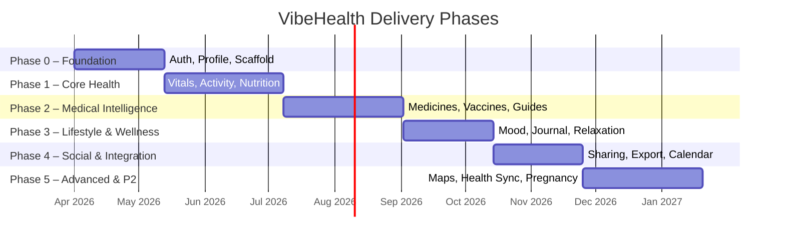
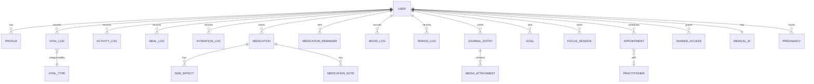

# 🐰 VibeHealth — Product Roadmap

> **Vision**: A comprehensive, personal health companion — powered by a friendly bunny mascot — that unifies vitals tracking, medical intelligence, wellness tools, and lifestyle features into one delightful app.

---

## Tech Stack (from scaffold prompt)

| Layer | Technology |
|---|---|
| Runtime / PM | **Bun** |
| API | **Hono** |
| Validation | **Zod** |
| ORM | **Prisma** |
| Database | **PostgreSQL** |
| Auth | **BetterAuth** |
| Frontend | **Angular 21 + Tailwind CSS** |
| Animations | **animate.js** |
| Infra | Docker Compose, Caddy, nginx, CI |

---

## Phase Overview

---

## Phase 0 — Foundation *(~6 weeks)*

> Scaffold, auth, onboarding, bunny mascot, design system, offline essentials, and i18n.

### 0.1 Project Scaffold
- Bun + Hono API with structured routes/services/schemas
- Prisma schema, PostgreSQL via Docker Compose
- Angular 21 **PWA** with Tailwind, routing, shared modules
- CI pipeline (lint → typecheck → test → build → container)
- Environment config (`.env` with safe placeholders)
- **Service Worker** setup for offline caching from day one

### 0.2 Authentication & Accounts
- BetterAuth integration (email/password, OAuth, magic links)
- Session management & JWT refresh
- Role model: user, caregiver (read-only shared access), admin

### 0.3 Onboarding / Profiling Wizard
Multi-step wizard collecting:
- Name, date of birth, biological sex, height, weight
- Medical conditions, allergies, current medications
- Fitness level, goals (weight loss, muscle gain, maintenance, wellness)
- Menstrual cycle info (optional)
- Pregnancy status (optional)
- Notification preferences (web push, device push, email)

### 0.4 Bunny Mascot System 🐰
- Mascot component with idle, happy, sad, encouraging states
- Bunny reacts to user actions (logging, streaks, milestones)
- Carrot reward system (used by the Focus Helper in Phase 3)

### 0.5 Medical ID
- Emergency card: name, age, blood type, allergies, medications, emergency contacts
- Always-accessible (even from lock screen concept)
- QR code generation for quick scan
- **Offline-ready** — cached via Service Worker, works without network

### 0.6 Design System & Shared UI
- Color palette, typography, spacing tokens
- Reusable components: cards, charts, modals, bottom nav, FAB
- Dark mode support
- Micro-animations (animate.js)

### 0.7 Internationalization (i18n)
- Angular i18n / ngx-translate setup
- FR + EN locales shipped from day one
- Translation file structure ready for future languages
- Date, number, and unit formatting per locale

### 0.8 First Aid Guide & Survival Tips *(offline-first)*
- Offline-first quick-reference cards (cached at install)
- Categories: burns, choking, CPR, fractures, allergic reactions, etc.
- Step-by-step illustrated guides
- Emergency-number shortcuts by country
- **Helpline directory** — curated crisis hotlines, one-tap call/chat, bunny comfort messages

---

## Phase 1 — Core Health Tracking *(~8 weeks)*

> Vitals, activity, nutrition, hydration, and goals.

### 1.1 Vitals Dashboard
- **Steps** — daily/weekly/monthly graph, daily goal, streaks
- **Heart rate** — resting, active, trends, abnormal alerts
- **Sleep** — duration, quality score, sleep stages (if data available)
- **Speed / Distance** — per-activity and aggregated
- **Other vitals** — blood pressure, blood oxygen, temperature, weight

> Each vital: current value card → trend chart → averages (7d/30d/90d) → threshold warnings

### 1.2 Activity Tracking
- Automatic activity detection placeholders (walk, run, cycle)
- Manual activity logging (type, duration, intensity, notes)
- Daily active minutes & calorie burn estimation

### 1.3 Nutrition & Calories Tracking
- Food diary with meal categories (breakfast, lunch, dinner, snacks)
- Calorie, macro (protein/carbs/fat), and micro-nutrient tracking
- Barcode scanner placeholder for packaged foods
- Daily/weekly nutritional summaries and goal comparison

### 1.4 Hydration Tracking
- Quick-log buttons (glass, bottle, custom amount)
- Daily goal based on profile (weight, activity level, climate)
- Reminders at configurable intervals
- Visual progress (water fill animation)

### 1.5 Health & Workout Goals
- SMART goal creation (specific, measurable, time-bound)
- Categories: steps, weight, hydration, sleep, nutrition, custom
- Progress tracking with milestone celebrations (bunny reacts!)
- Weekly and monthly report cards

---

## Phase 2 — Medical Intelligence *(~8 weeks)*

> Medicines, health checks, vaccines, guides, first aid, pollen.

### 2.1 Medicine Tracker & Reminders
- Add medications: name, dose, frequency, time(s), duration
- Reminder notifications (web push, device push, email) with snooze
- **Side effects database** — sourced from free/open APIs (OpenFDA, ANSM open data)
- Personal notes per medication
- Interaction warnings when multiple meds are tracked
- Refill reminders

### 2.2 Health Checks & Vaccines
- Recommended screenings based on age + sex + conditions
- Vaccine schedule (childhood, adult boosters, travel)
- **Personalized reminders** factoring:
  - Age, sex, medical history
  - Current medications
  - Estimated delay before appointment (configurable)
- Appointment logging with past/upcoming views

### 2.3 Guides & Articles
- Condition library: searchable, categorized
- Content sourced from free/open medical databases
- Articles linked to user's tracked conditions and medications
- Bookmarking and reading history
- Content management: markdown articles with images

### 2.4 Pollen Tracking
- Current pollen levels by location (free open API)
- Forecasts (3–5 day)
- Allergen-specific alerts (grass, tree, weed, mold)
- Push notifications when levels are high for user's allergens

---

## Phase 3 — Lifestyle & Wellness *(~6 weeks)*

> Mood, periods, journaling, workouts, relaxation, focus.

### 3.1 Mood Tracker
- Quick mood log (emoji scale + optional tags: anxious, energetic, calm…)
- Trend chart correlating mood with sleep, activity, weather
- Daily/weekly reflections
- Bunny reacts empathetically

### 3.2 Period Tracker
- Cycle logging: period start/end, flow intensity, symptoms
- Predictions for next period and fertile window
- **Pill reminders** (contraceptive, with configurable times)
- Symptom history and trend analysis
- Optional pregnancy-mode switch (disables period predictions, enables pregnancy tracking)

### 3.3 Journaling
- Rich entries: text (Markdown), images, audio, video, locations
- Tags, moods, and searchable history
- Calendar view and list view
- Media gallery with thumbnails
- Private by default, shareable per entry

### 3.4 Workouts Tab
- **Exercise suggestions** based on profile (fitness level, goals, equipment)
- Categories: strength, cardio, flexibility, HIIT, yoga
- Pre-built workout plans + custom creation
- Timer, rep counter, rest intervals
- Post-workout summary linked to vitals (HR, calories)

### 3.5 Relaxation & Meditation
- Ambient sounds library (rain, ocean, forest, white noise)
- Guided meditation audio (breathing, body scan, sleep)
- Timer mode (custom durations)
- Session history and streaks

### 3.6 Focus Helper
- **Focus session** timer (Pomodoro or custom)
- Screen-lock concept: "Stay focused or bunny doesn't get its carrot! 🥕"
- Leave penalty: bunny looks sad, carrot counter resets
- Focus stats and streaks
- Do-not-disturb integration hint (OS-level)

---

## Phase 4 — Social & Integration *(~6 weeks)*

> Sharing, export, calendar/Doctolib sync, pregnancy.

### 4.1 Data Sharing with Relatives
- Invite relatives/caregivers via email or link
- Granular permission: which data categories are shared
- Read-only dashboard for caregivers
- Revoke access at any time
- Activity feed for shared profiles

### 4.2 Export & Data Portability
- **Export Medical ID** → PDF (printable card)
- **Export health data** → PDF report, CSV, ZIP archive
- Date range selection and category filters
- Scheduled exports (weekly/monthly email)

### 4.3 Calendar & Doctolib Sync
- iCal sync for appointments and reminders
- **Doctolib integration** (OAuth if available, or manual import)
- Appointment reminders with prep notes
- Two-way sync: app ↔ calendar

### 4.4 Pregnancy Tracking
- Week-by-week guides (fetal development, mother changes)
- Kick counter
- Contraction timer
- Appointment schedule (ultrasounds, blood tests)
- Symptom log adapted for pregnancy
- Postpartum mode transition

---

## Phase 5 — Advanced & P2 Features *(~8 weeks)*

> Practitioner map, health platform sync, and hardening.

### 5.1 Practitioner Map *(P2)*
- Interactive map with nearby practitioners (doctors, dentists, pharmacies, specialists)
- Data sourced from **free/open APIs** (e.g. OpenStreetMap + Overpass, government health directories)
- **Search & filter**: specialty, distance, availability, ratings
- Directions integration (open in Maps)
- Favorite practitioners

### 5.2 Health Platform Sync *(P2)*
- **Google Fit** — read/write vitals, activity
- **Samsung Health** — read/write vitals, activity
- *(Apple HealthKit out of scope — PWA-only, no native iOS)*
- Conflict resolution: app data vs. platform data
- Sync frequency and toggle per data type

### 5.3 Final Polish & Hardening
- Accessibility audit (WCAG 2.1 AA)
- Performance optimization (lazy loading, caching, CDN)
- Security audit & penetration test
- GDPR compliance: data deletion, consent management, privacy dashboard
- Additional locale packs (community-contributed translations)

---

## Priority Matrix

| Priority | Features |
|---|---|
| **P0 — Must** | Auth, Profiling, Medical ID, Vitals, Activity, Nutrition, Hydration, Goals, Medicines, Bunny Mascot |
| **P1 — Should** | Health Checks, Vaccines, Mood, Period, Workouts, Journal, First Aid, Helpline, Guides, Export, Sharing, Relaxation, Focus, Pollen, Pregnancy, Calendar Sync |
| **P2 — Nice** | Practitioner Map, Google/Samsung/Apple Health Sync, Doctolib Sync, Barcode Scanner |

---

## Data Model Highlights

---

## Key Architecture Decisions

| Decision | Rationale |
|---|---|
| Monorepo (API + Frontend) | Simpler CI, shared types via Zod-to-TS |
| PostgreSQL + Prisma | Relational data fits health records; Prisma gives type safety |
| Hono API with versioned routes | Lightweight, fast, easy to version (`/api/v1/…`) |
| Markdown-based articles | Easy to author, version-control, and render |
| PWA-only (no native) | Simpler build/deploy; installable on mobile via browser |
| Offline-first for critical features | Medical ID, First Aid & Journal cached via Service Worker from Phase 0 |
| i18n from day one | FR + EN shipped in Phase 0; translation file structure ready for future locales |
| External APIs behind adapters | Pollen, maps, drug DBs — abstracted so free providers can be swapped |
| Notification service abstraction | Web push, device push (FCM), email — unified interface |

---

## Risk Register

| Risk | Impact | Mitigation |
|---|---|---|
| Medical data regulations (GDPR, HDS) | High | Encrypt at rest, audit logging, consent flows, legal review |
| Scope creep (25+ features) | High | Strict phase gates; MVP = Phase 0 + 1 |
| Third-party API reliability (pollen, maps, Doctolib) | Medium | Circuit breakers, caching, graceful degradation |
| Performance with large datasets (years of vitals) | Medium | Pagination, materialized views for aggregates, archival strategy |
| PWA limitations (no HealthKit, limited background) | Medium | Design around web APIs; Health Sync limited to Google Fit / Samsung Health web APIs |

---

## Resolved Decisions

| Question | Decision |
|---|---|
| Mobile strategy | **PWA-only** — installable via browser, no native wrappers |
| Medical content source | **Free/open APIs** — OpenFDA, ANSM open data, open drug databases |
| Practitioner data | **Free/open APIs** — OpenStreetMap, government health directories |
| Notification channels | **Web push + device push (FCM) + email** |
| Monetization | **None** — personal/portfolio project, all features free |
| Language/locale | **FR + EN from day one**, i18n architecture ready for future languages |
